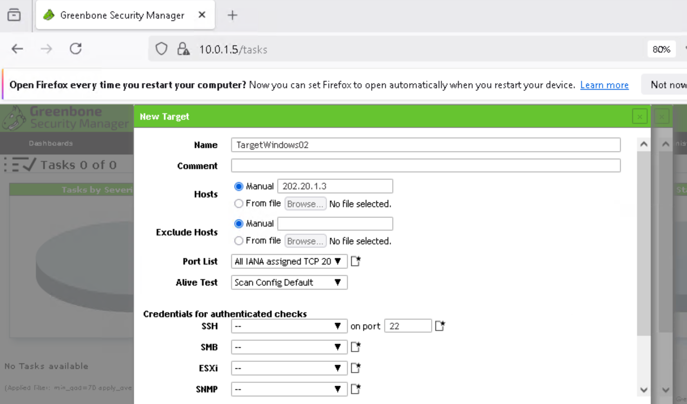

# 🔥 Firewall Penetration Test & Attack Surface Reduction

## 📌 Overview

This project documents a structured firewall penetration test conducted in a segmented lab environment. The objective was to identify exposed services, assess vulnerabilities, reduce the attack surface through firewall rule hardening, and validate remediation through re-scanning.

The engagement followed this workflow:

- Attack surface analysis  
- Service enumeration (Nmap)  
- Vulnerability assessment (Nessus / OpenVAS)  
- Firewall rule hardening  
- Post-remediation validation  

---

## 🖥️ Lab Environment

**Infrastructure:**
- pfSense Firewall  
- Windows Server (public-facing)  
- Linux Web Server  
- Kali Linux attacker machine  

**Tools Used:**
- Nmap  
- Nessus Essentials  
- Greenbone (OpenVAS)  

### Network Topology

---

## 🌐 Initial Attack Surface

Firewall inspection revealed:

- Public 1:1 NAT exposure of an internal server  
- WAN rules allowing HTTP and HTTPS access  
- An overly permissive “Default allow LAN to any” rule  

### WAN Rules (Before Hardening)

### NAT Mapping

### Virtual IP Configuration

### Default LAN Rule

These configurations increased the attack surface by allowing unnecessary inbound and outbound traffic.

---

## 🔎 Open Services Identified

Manual enumeration was performed using Nmap with service detection and OS fingerprinting.

Open services detected included:

- FTP (21/tcp)  
- SSH (22/tcp)  
- HTTP (80/tcp)  

These results confirmed that multiple services were externally reachable and potentially exploitable.

---

## 🛡️ Vulnerability Assessment

Nessus scanning identified multiple medium-severity findings, including:

- TLS 1.0 enabled  
- Self-signed SSL certificate  
- SMB signing not enforced  
- Service configuration weaknesses  

### Nessus Summary

### Nessus Detailed Findings

### Greenbone Validation

The assessment confirmed that firewall misconfiguration contributed directly to risk exposure.

---

## 🔧 Security Hardening

The following remediation steps were implemented:

- Removed unnecessary WAN firewall rules  
- Deleted “Default allow LAN to any” rule  
- Restricted inbound access to required services only  
- Reduced publicly exposed ports  

These actions significantly reduced the external attack surface.

---

## ✅ Post-Remediation Validation

After hardening, re-scanning confirmed:

- Previously open services were no longer externally accessible  
- Scanned ports were filtered or properly restricted  
- Vulnerabilities were eliminated or significantly reduced  

### Nmap Filtered Scan

### Final Nessus Scan

This validated that firewall rule enforcement was effective.

---

## 📊 Before vs After

| Category | Before | After |
|----------|--------|--------|
| NAT Exposure | Enabled | Restricted |
| WAN Open Ports | Multiple services | Filtered |
| LAN Default Rule | Allow any | Removed |
| Vulnerabilities | Multiple findings | Reduced / Eliminated |
| External Scan | Services exposed | No accessible services |

---

## 🧠 Skills Demonstrated

- Network reconnaissance (Nmap)  
- Vulnerability assessment (Nessus, OpenVAS)  
- Firewall rule analysis (pfSense)  
- Attack surface reduction  
- Security remediation workflow  
- Validation and re-testing  

---

## 🔐 Key Takeaways

- Overly permissive firewall rules dramatically increase attack surface.  
- NAT exposure must be tightly controlled.  
- Vulnerability scanning should be paired with configuration review.  
- Post-remediation validation is critical.  
- Effective security requires both offensive testing and defensive hardening.  

---

## 🚀 Conclusion

This project demonstrates a complete firewall penetration testing and hardening lifecycle. Through reconnaissance, vulnerability assessment, rule modification, and validation scanning, the overall attack surface was successfully reduced.
