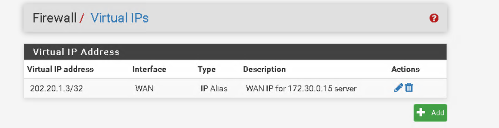
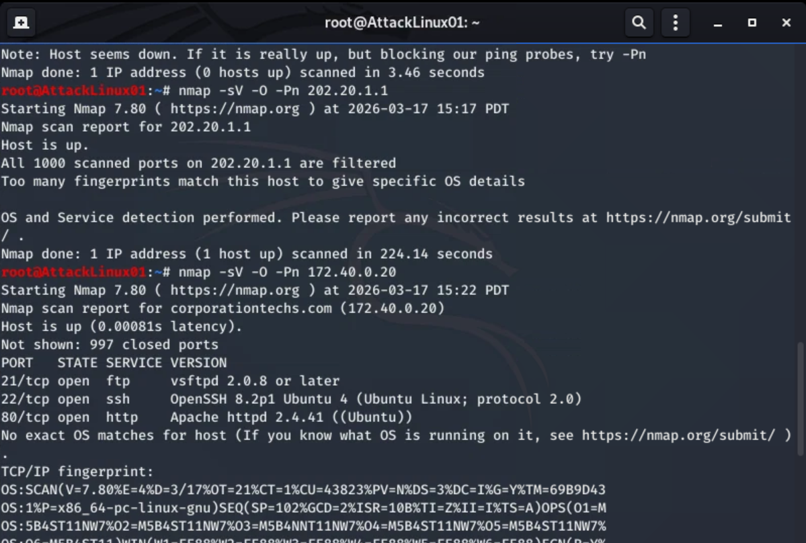

# 🔥 Firewall Penetration Test & Attack Surface Reduction

## 📌 Overview

This lab demonstrates a structured firewall penetration test followed by attack surface reduction and remediation validation.

The objective was to:

- Identify externally exposed services
- Assess vulnerabilities
- Harden firewall configurations
- Validate remediation effectiveness

---

## 🖥️ Lab Environment

### Infrastructure

- pfSense Firewall
- Windows Server (Public-Facing Host)
- Linux Target Server
- Kali Linux (Attacker Machine)

### Network Topology

The environment consists of a segmented internal network behind a pfSense firewall with public NAT exposure.

---

# 1️⃣ Initial Attack Surface Analysis

Before testing, firewall rules and NAT configurations were reviewed.

### WAN Rules (Before Hardening)

These rules allowed inbound HTTP/HTTPS traffic to the internal server.

### 1:1 NAT Mapping

The internal Windows server (172.30.0.15) was directly mapped to a public IP.

### Virtual IP Configuration

The WAN interface had an IP alias exposing the internal host externally.

### Default LAN Rule

A “Default allow LAN to any” rule was present, permitting unrestricted outbound access.

⚠️ These configurations significantly increased the firewall’s attack surface.

---

# 2️⃣ Service Enumeration (Nmap)

Active reconnaissance was performed from the attacker machine using Nmap with:

- Service detection
- Version detection
- OS fingerprinting

The scan revealed externally accessible services including:

- FTP (21)
- SSH (22)
- HTTP (80)

### Nmap Service & OS Detection Output

This confirmed that multiple services were publicly reachable.

---

# 3️⃣ Vulnerability Assessment

After identifying exposed services, vulnerability scanning was conducted using Nessus.

### Nessus Scan Summary

Both hosts were scanned using a Basic Network Scan policy.

The scan identified several medium-severity vulnerabilities.

### Nessus Detailed Findings

Key issues included:

- Weak TLS configuration
- Self-signed certificates
- SMB configuration weaknesses
- Outdated services

These findings confirmed that exposed services introduced measurable risk.

---

# 4️⃣ Firewall Hardening & Attack Surface Reduction

To reduce risk, the following changes were implemented:

- Removed unnecessary WAN rules
- Restricted inbound service exposure
- Removed overly permissive LAN rules
- Reduced NAT exposure
- Limited public service access

Firewall rules were restructured to follow a least-privilege model.

---

# 5️⃣ Post-Remediation Validation

After hardening, re-scanning was performed to validate improvements.

### Nmap Post-Hardening Scan

Previously open ports were now filtered or inaccessible.

### Final Nessus Scan

The final scan showed vulnerabilities were eliminated or significantly reduced.

This confirmed that firewall modifications were effective.

---

# 📊 Before vs After

| Category | Before | After |
|----------|--------|--------|
| Public NAT Exposure | Enabled | Restricted |
| Open Services | Multiple exposed | Filtered |
| LAN Rule | Allow Any | Restricted |
| Vulnerabilities | Medium findings | Reduced / Removed |

---

# 🧠 Skills Demonstrated

- Network reconnaissance (Nmap)
- Vulnerability assessment (Nessus)
- Firewall rule analysis (pfSense)
- NAT configuration review
- Attack surface reduction
- Security remediation validation

---

# 🔐 Key Takeaways

- Firewall misconfigurations directly expand attack surface.
- NAT exposure must be tightly controlled.
- Vulnerability scans validate real-world impact.
- Hardening must always be followed by re-testing.
- Defense requires both offensive testing and corrective action.

---

# 🚀 Conclusion

This lab demonstrates a complete penetration testing and firewall hardening lifecycle. Through structured reconnaissance, vulnerability analysis, configuration review, and remediation validation, the firewall’s attack surface was successfully reduced.
