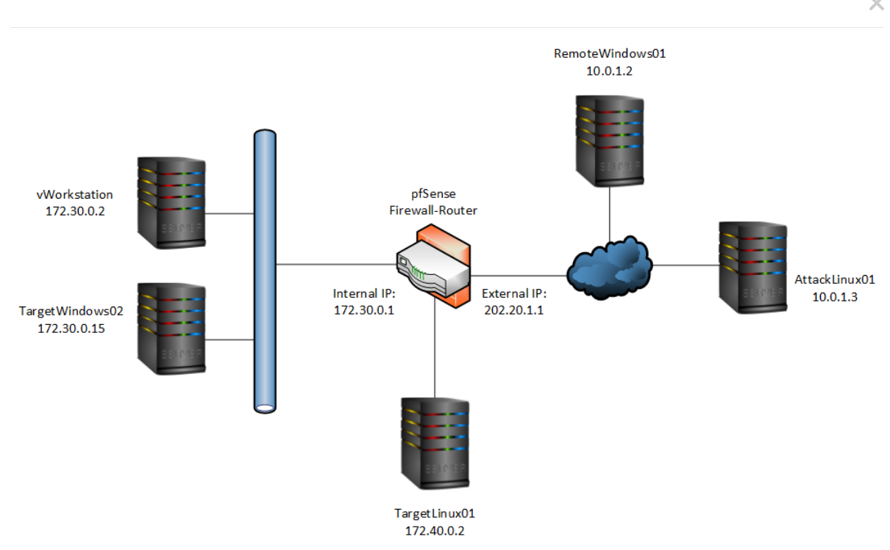
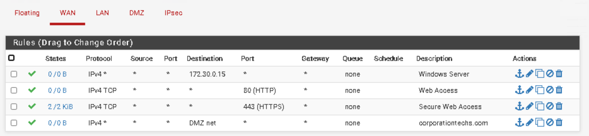
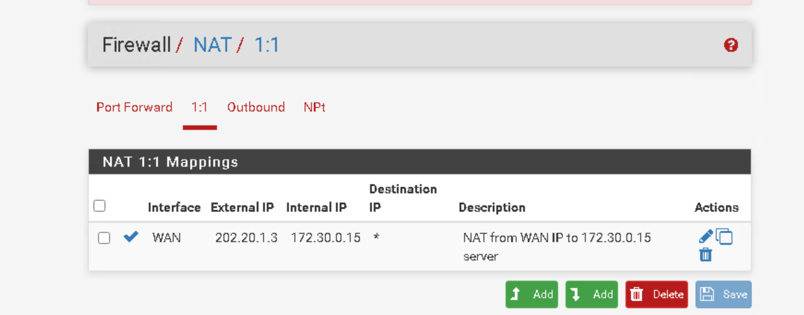
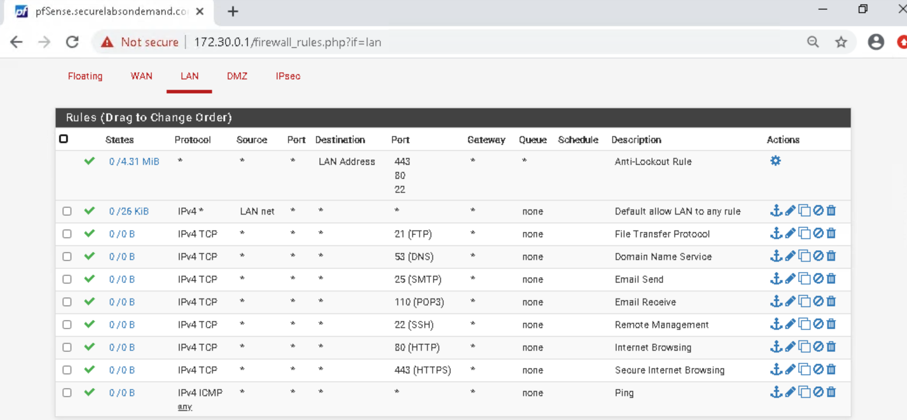
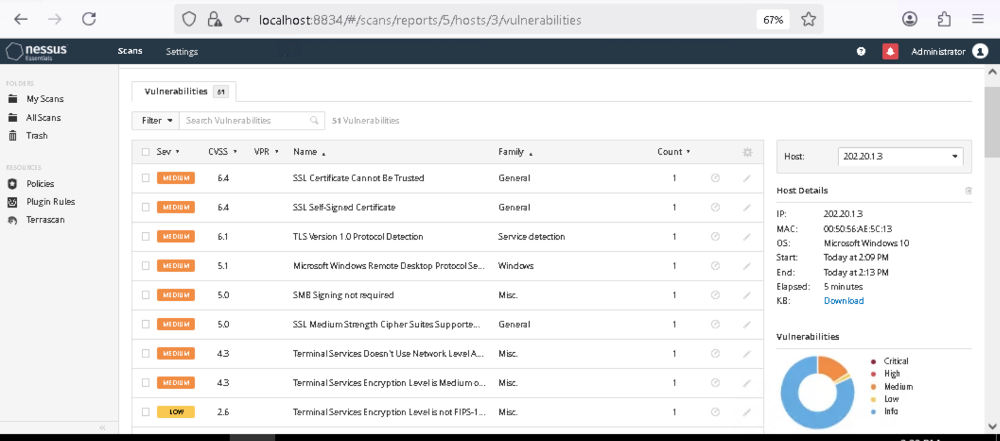
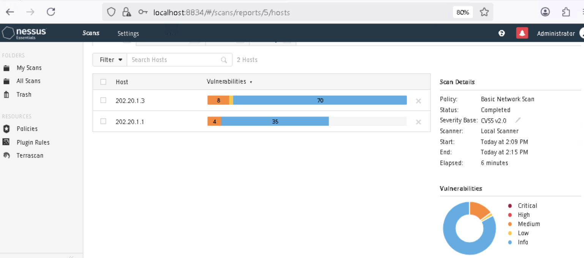
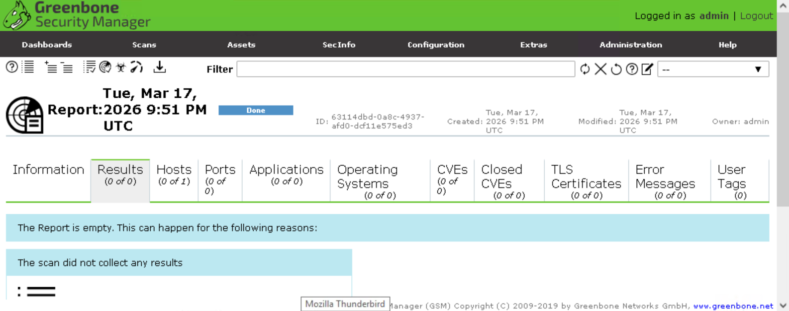
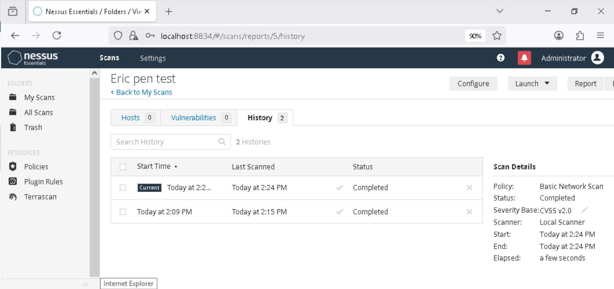

# 🔥 Firewall Penetration Test & Attack Surface Reduction

## 📌 Overview

This lab demonstrates a structured firewall penetration test followed by configuration hardening and remediation validation.

The objective was to:

- Identify externally exposed services
- Assess vulnerabilities
- Reduce firewall attack surface
- Validate security improvements

---

# 🖥️ Lab Environment

## Infrastructure

- pfSense Firewall
- Windows Server (172.30.0.15)
- Linux Target Host
- Kali Linux Attacker Machine

## Network Topology

The environment consists of segmented internal hosts protected by a pfSense firewall with public exposure.

The Windows server was externally reachable via public IP mapping.

---

# 1️⃣ Initial Firewall Exposure Review

Before conducting active scanning, firewall configurations were analyzed.

## WAN Rules (Pre-Hardening)

Inbound HTTP/HTTPS traffic was permitted to the internal server.

This rule allowed direct exposure of internal services to the external network.

---

## Virtual IP Configuration

A WAN IP alias was configured, mapping the internal Windows server to a public IP address.

This confirmed that the internal host was publicly reachable.

---

## Default LAN Rule

A permissive “Default allow LAN to any” rule was present.

This configuration allowed unrestricted outbound traffic, increasing risk in the event of compromise.

⚠️ At this stage, the firewall configuration significantly expanded the attack surface.

---

# 2️⃣ Service Enumeration (Nmap)

Active reconnaissance was performed from the attacker machine using Nmap with:

- Service detection (-sV)
- OS detection (-O)
- Version enumeration

## Nmap Service & OS Detection Output

The scan identified publicly accessible services including:

- FTP (21/tcp)
- SSH (22/tcp)
- HTTP (80/tcp)

This confirmed that multiple services were exposed externally through firewall configuration.

---

# 3️⃣ Vulnerability Assessment (Nessus)

After confirming exposed services, a vulnerability scan was conducted.

## Nessus Detailed Findings

The scan identified multiple medium-severity vulnerabilities across the exposed host, including:

- Weak TLS configuration
- Self-signed certificates
- Outdated service versions
- Insecure protocol configurations

These vulnerabilities were directly tied to the exposed services.

---

## Nessus Scan Summary

The summary view provided an aggregate vulnerability count across the scanned hosts, confirming measurable security risk.

---

# 4️⃣ Firewall Hardening & Attack Surface Reduction

To mitigate risk, the following changes were implemented:

- Removed unnecessary WAN exposure rules
- Restricted inbound service access
- Reduced public host exposure
- Removed overly permissive LAN rule
- Applied least-privilege firewall policy

These changes reduced the externally reachable attack surface.

---

# 5️⃣ Post-Remediation Validation

After implementing firewall hardening, re-scanning was performed to validate improvements.

## Greenbone Validation Scan

An additional vulnerability scan was performed using a separate scanning tool to confirm remediation effectiveness.

The scan results showed significant reduction in previously identified findings.

---

## Final Nessus Scan Summary

A final Nessus scan was conducted to validate remediation.

The results confirmed that vulnerabilities were eliminated or significantly reduced following firewall hardening.

---

# 🚀 Conclusion

This lab demonstrates a complete penetration testing and firewall hardening lifecycle. Through reconnaissance, vulnerability assessment, configuration review, remediation, and validation scanning, the firewall’s attack surface was successfully reduced.
